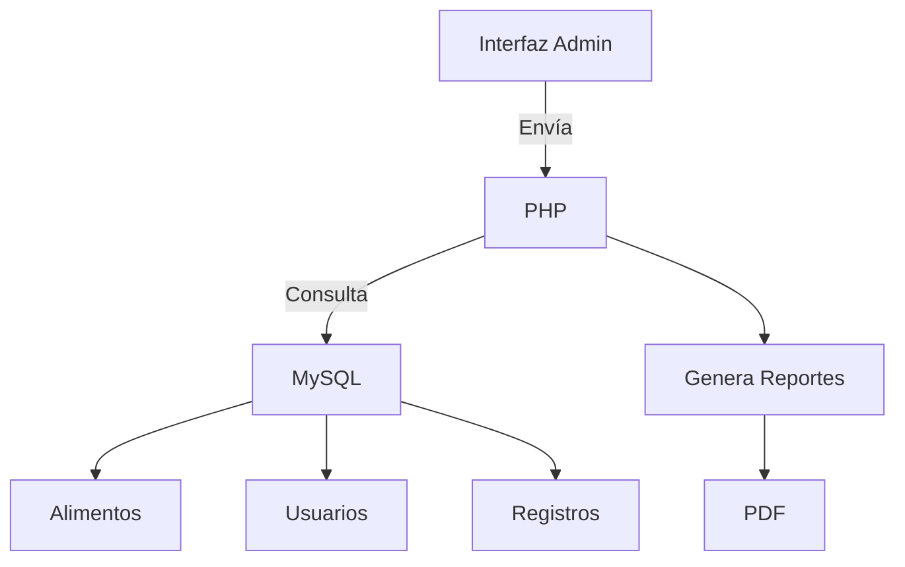

# 🍏 FitMe - Sistema Administrativo de Nutrición

---

### 🍽️ Gestión de Alimentos

<p>
<strong>Registro detallado</strong>: Los usuarios pueden agregar cada comida con:<br>
  - 🕒 Fecha y hora exacta<br>
  - 🍎 Tipo (desayuno, almuerzo, cena, snack)<br>
  - 📝 Ingredientes específicos<br>
  - 🏷️ Porciones y cantidades exactas
</p>

<p>
<strong>Edición flexible</strong>: Modificar comidas registradas:<br>
  - ✏️ Actualizar ingredientes<br>
  - ⚖️ Ajustar porciones<br>
  - 🗑️ Eliminar entradas incorrectas
</p>

## 🏗 Arquitectura del Sistema



### 🔷 Capas Principales

##### Frontend (HTML/CSS/JS)

Dashboard administrativo

Tablas dinámicas con DataTables

Gráficos con Chart.js

##### Backend (PHP)

Lógica de negocios

Generación de reportes

Autenticación segura

##### Base de Datos (MySQL)

Registros nutricionales

Perfiles de usuarios

Históricos completos

#### 🛠 Stack Tecnológico

<div align="center">

| **Capa**       | **Tecnologías**                     | **Versión**   |
|----------------|-------------------------------------|---------------|
| Frontend       | Bootstrap 5 • HTML • DataTables   | 3.6+          |
| Backend        | PHP 8 • Apache                      | XAMPP 8.2+    |
| Base de Datos  | MySQL                               | 10.4+         |

</div>

### 🗂 Estructura del Proyecto
```bash
fitme/
├── 📁 assets/               # Recursos estáticos
│   ├── css/                 # Estilos personalizados
│   └── js/                  # Scripts custom
├── 📁 includes/             # Lógica compartida
│   ├── auth/                # 🔐 Autenticación
│   └── db.php               # 🗃️ Conexión MySQL
├── 📁 modules/              # Funcionalidades
│   ├── users/               # 👥 Gestión usuarios
│   ├── foods/               # 🍎 Registro alimentos
│   └── reports/             # 📊 Generador PDF
└── 📁 vendor/               # Dependencias externas
```

### ⚙️ Instalación
```bash
# 1. Clonar repositorio
git clone https://github.com/GabooMedina/Fitme.git

# 2. Mover a htdocs de XAMPP
mv fitme /opt/lampp/htdocs/

# 3. Importar base de datos
mysql -u root -p < database/fitme.sql
```

### 📋 Requisitos:

XAMPP 8.2+ (Apache, PHP, MySQL)

Navegador moderno (Chrome, Firefox, Edge)

500MB espacio mínimo en disco

### 🖥️ Acceso
🔗 URL: http://localhost/fitme

### 👤 Autor
Gabriel Medina